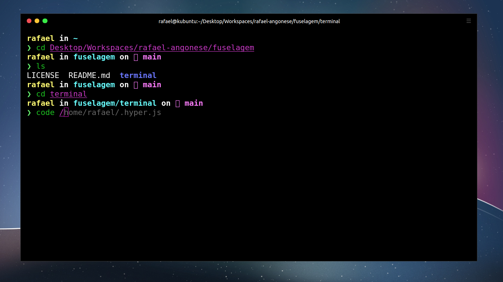

<h1 align="center">🧙 <strong>Terminal</strong></h1>

Customizando o melhor terminal para desenvolvedores.

Todo desenvolvedor utiliza (ou já utilizou) um terminal em sua carreira. É com eles que utilizamos comandos para executar determinada tarefa em um projeto ou aplicação. Dentre diversas opções disponíveis na internet, uma que particularmente gosto muito é o Hyper em conjunto com o OhMyZSH. Veremos como instalá-las e o quanto este terminal pode nos auxiliar em nosso dia-a-dia.



---

## 🦩 **Terminal Hyper**


```bash
rafael ~ # Hyper é feito utilizando Electron

rafael ~ # Ou seja utilizando HTML/CSS/JS

rafael ~ # É totalmente extensível

rafael ~ # Possbilidade de instalar temas e plugins para o terminal

rafael ~ # É de código aberto - Open Source

rafael ~

```

---

## **🦸🏼‍♀️ Download Hyper**

A instalação do Hyper é muito simples, basta acessar o site da ferramenta em seu site oficial, selecionar a versão com base no sistema operacional que você utiliza e fazer a instalação. Ao final deste processo, o Hyper já estará disponível e pronto para ser utilizado.

Basta acessar o site oficial:

- [Hyper](https://hyper.is/).
- [Github Hyper](https://github.com/vercel/hyper).

Para deixar o Hyper como o terminal padrão no linux, possibilitando assim abrir utilizando o atalho CTRL+ALT+T.

```bash
$ sudo update-alternatives --config x-terminal-emulator

# escolha a opção do terminal Hyper como padrão

```

Porém, o Hyper irá utilizar o shell padrão do sistema operacional, então precisamos alterá-lo.

---

## 🐝 **Oh My ZSH**

O OhMyZSH é um framework open-source mantido pela comunidade para gerenciar a configuração do ZSH, um interpretador de comandos UNIX (shell) que pode ser utilizado como processador de comandos de script, e melhorar o workflow de desenvolvimento.

Antes de conseguirmos iniciar com qualquer configuração precisamos instalar o ZSH, o ZSH é o shell que o OhMyZSH utiliza.

Para instalar o ZSH basta utilizar o comando abaixo, para mais informações podemos acessar o github [Installing-ZSH](https://github.com/ohmyzsh/ohmyzsh/wiki/Installing-ZSH)

```bash
$ sudo apt install zsh

# Com o ZSH instalado, podemos executar o comando abaixo

$ zsh --version
zsh 5.8 (x86_64-ubuntu-linux-gnu)

```

---

## **🍄 Download Oh My ZSH**

Para instalar o Oh My Zsh você podes seguir a documentação [Github OhMyZsh](https://github.com/ohmyzsh/ohmyzsh).

Vamos instalar utilizando o cURL. Para instalar o cURL execute o seguinte comando.

```bash
$ sudo apt install curl

# Com o cURL instalado, podemos executar o comando abaixo

$ curl --version
curl 7.68.0 (x86_64-pc-linux-gnu)

```

Instalando o OhMyZsh.

```bash
$ sh -c "$(curl -fsSL https://raw.githubusercontent.com/ohmyzsh/ohmyzsh/master/tools/install.sh)"

```

Feito isso, o OhMyZSH estará instalado e funcionando.

Caso o zsh não fique como padrão na sua máquina, você pode executar o seguinte comando para torna-lo padrão.

```bash
$ chsh -s $(which zsh)

```
Substituindo assim o bash para o zsh

---

## **🔮 Plugins**

Para instalar plugins no Zsh vamos utilizar o Zinit.

O Zinit é um gerenciador de plugins Zshell flexível e rápido que permitirá que você instale e remova plugins no Zsh com facilidade.

Para instalar o Zinit podemos seguir a documentação [Github Zinit](https://github.com/zdharma/zinit).

Instalando o Zinit.

```bash
$ sh -c "$(curl -fsSL https://raw.githubusercontent.com/zdharma/zinit/master/doc/install.sh)"

```

Após essa instalação, vamos abrir o arquivo `~/.zshrc` com o editor de texto de sua preferência, eu utilizo o Visual Studio Code.

```bash
$ code ~/.zshrc

```

Abaixo da linha `### End of Zinit's installer chunk` que foi adicionada automaticamente no arquivo, vamo adicionar os seguintes plugins:

```bash
zinit light zsh-users/zsh-autosuggestions
zinit light zsh-users/zsh-completions
zinit light zdharma/fast-syntax-highlighting

```

- `zsh-users/zsh-autosuggestions:` Sugere comandos baseados no histórico de execução conforme você vai digitando.

- `zsh-users/zsh-completions:` Adiciona milhares de completitions para ferramentas comuns como Yarn, Node, etc, para você precisar apenas apertar TAB para completar comandos.

- `zdharma/fast-syntax-highlighting:` Adiciona syntax highlighting na hora da escrita de comandos que facilita principalmente em reconhecer comandos que foram digitados de forma incorreta.

---

## **🚀 Spaceship**

A Spaceship é um prompt Zsh minimalista, poderoso e extremamente personalizável. Combina tudo o que você precisa para um trabalho conveniente, sem complicações desnecessárias, como uma nave espacial de verdade. Vamos utilizar para modificar como as informações são exibidas.

Para instalar o tema Spaceship podemos seguir a documentação [Github Spaceship](https://github.com/spaceship-prompt/spaceship-prompt).

Instalando o Spaceship.

```bash
$ git clone https://github.com/spaceship-prompt/spaceship-prompt.git "$ZSH_CUSTOM/themes/spaceship-prompt" --depth=1

# Criar um link simbólico
$ ln -s "$ZSH_CUSTOM/themes/spaceship-prompt/spaceship.zsh-theme" "$ZSH_CUSTOM/themes/spaceship.zsh-theme"

```

Após a instalação, vamos abrir novamente o arquivo `~/.zshrc`.

```bash
$ code ~/.zshrc

```

Agora dentro do arquivo `~/.zshrc` vamos alterar o tema para o tema da Spaceship, para isso, sete o valor do ZSH_THEME para spaceship.

```bash
ZSH_THEME="spaceship"

```

Pronto agora o tema da Spaceship está instaldo e funcionando, enfim agora podemos configurar de acordo com o nosso gosto.

No final do arquivo `~/.zshrc` vamos adicionar as seguintes configurações.

```bash
# Theming
LS_COLORS=$LS_COLORS:'ow=01;34:' ; export LS_COLORS

SPACESHIP_PROMPT_ORDER=(
  user          # Username section
  dir           # Current directory section
  host          # Hostname section
  git           # Git section (git_branch + git_status)
  hg            # Mercurial section (hg_branch  + hg_status)
  exec_time     # Execution time
  line_sep      # Line break
  vi_mode       # Vi-mode indicator
  jobs          # Background jobs indicator
  exit_code     # Exit code section
  char          # Prompt character
)

SPACESHIP_USER_SHOW="always" # Shows System user name before directory name
SPACESHIP_PROMPT_ADD_NEWLINE=false
SPACESHIP_CHAR_SYMBOL="❯"
SPACESHIP_CHAR_SUFFIX=" "
# SPACESHIP_PROMPT_SEPARATE_LINE=false # Make the prompt span across two lines
# SPACESHIP_DIR_TRUNC=1 # Shows only the last directory folder name

```

Essas configurações são preferências minhas que gosto de utilizar em meu terminal, por isso fique à vontade para incluir/excluir qualquer opção. Vale ressaltar que o spaceship é totalmente customizável [Github spaceship doc options](https://github.com/spaceship-prompt/spaceship-prompt/blob/master/docs/options.md).

---

## **🧛 Dracula**

Uma alternativa ao tema da Spaceship é utilizar o tema Dracula, o tema Dracula é amplamente utilizado e possui suporte para diversas aplicações.

- [Dracula theme](https://draculatheme.com/).
- [Dracula theme for Zsh](https://draculatheme.com/zsh).
- [Github Dracula theme](https://github.com/dracula/dracula-theme).

Instalando o Dracula theme.

```bash
$ git clone https://github.com/dracula/zsh.git

# Criar um link simbólico
$ ln -s ~/zsh/dracula.zsh-theme ~/.oh-my-zsh/themes/dracula.zsh-theme

```

Após a instalação, vamos abrir novamente o arquivo `~/.zshrc`.

```bash
$ code ~/.zshrc

```

Agora dentro do arquivo `~/.zshrc` vamos alterar o tema para o tema Dracula, para isso, sete o valor do ZSH_THEME para dracula.

```bash
ZSH_THEME="dracula"

```

---

## **🦑 Exports**

Caso você tenha algum exports no final do seu arquivo `~/.bashrc` considere move-los para o seu `~/.zshrc`

No meu caso eu tenho alguns, veja o exemplo.

```bash
# Exports

# Java JDK
export JAVA_HOME=/home/rafael/.asdf/installs/java/openjdk-14.0.1

# Android SDK (React Native)
export ANDROID_HOME=/home/rafael/Android/Sdk
export PATH=$PATH:$ANDROID_HOME/emulator
export PATH=$PATH:$ANDROID_HOME/tools
export PATH=$PATH:$ANDROID_HOME/tools/bin
export PATH=$PATH:$ANDROID_HOME/platform-tools

export PATH=$PATH:/opt/android-studio/bin

```

Outros exemplos

```bash

# NVM
export NVM_DIR="$HOME/.nvm"
[ -s "$NVM_DIR/nvm.sh" ] && \. "$NVM_DIR/nvm.sh"  # This loads nvm
[ -s "$NVM_DIR/bash_completion" ] && \. "$NVM_DIR/bash_completion"  # This loads nvm bash_completion

# Yarn Global Packages Setup
export PATH="$PATH:$(yarn global bin)

```

---

## **🦕 Concluindo**

Agora temos um terminal customizado e muito mais produtivo.

Além disso meu arquivo `~/.zshrc` está diponível em: [~/.zshrc](.zshrc)  

---

Feito com 💜 by Rafael Angonese
